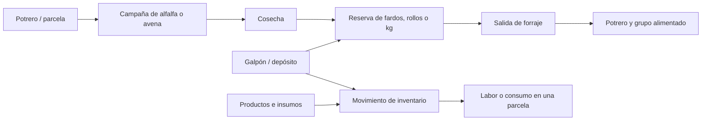

# Mapa completo y conexión con los recursos del campo

## Uso del mapa

Potreros abre con el mapa ampliado y sin un panel permanente. Lugares abre la búsqueda y los filtros; seleccionar una figura abre su ficha flotante. Capas reúne Mapa/Satélite y el color por estado. El zoom y Ver todo el campo permanecen accesibles. Volver al ERP recupera la navegación general.

En celular la ficha aparece abajo. Al dibujar, Datos y guardado permite ocultar el formulario para dejar libre el terreno y volver a abrirlo sin perder los vértices. Los controles de dibujo, deshacer y rehacer siguen sobre el mapa. El tamaño del mapa no cambia al abrir una ficha.

Desde la ficha de una parcela se puede abrir Cultivos y Forrajes filtrado por esa parcela. Cada campaña ofrece Volver al mapa. Desde un galpón se consultan sus productos y reservas, se abre la administración de esas reservas y se accede al inventario general. Las reservas que tienen depósito permiten regresar a su galpón.

## Lo que ya está conectado

| Información | Relación existente | Qué se puede hacer hoy |
| --- | --- | --- |
| Potrero o parcela | Sector | Ubicarlo una sola vez y usarlo para ganado y cultivos. |
| Campaña agrícola | SectorForraje.sectorId | Registrar alfalfa, avena u otro cultivo sobre la parcela; consultar las campañas desde el mapa. |
| Reserva de forraje | ReservaForraje.depositoId | Vincular fardos, rollos o kg a un galpón y ver allí el saldo. |
| Origen de una reserva | ReservaForraje.cultivoId, opcional | El servidor admite vincular una campaña del mismo campo y forraje; el formulario general todavía no ofrece elegirla. |
| Productos del galpón | MovimientoStock.sectorId | Entradas y salidas comparten el libro de movimientos de Inventario. No se crea un segundo saldo independiente. |
| Forraje consumido | MovimientoForraje.reservaId | Descontar existencias con fecha, cantidad, unidad y motivo, sin duplicar reintentos. |

Inventario general agrupa por las organizaciones a las que tiene acceso el usuario; actualmente no representa un galpón ni el campo seleccionado. Por eso el enlace se identifica como general. Las existencias de productos y las reservas de forraje usan registros distintos: no deben sumarse como si fueran el mismo stock.

## Recorrido recomendado para completar la integración

La cosecha como operación cuantificada, el destino del consumo por ID y su vinculación con labores son propuestas; no quedan implementadas por agregar los accesos de navegación.

1. **Reservas desde la campaña.** Agregar Crear reserva a la campaña, preseleccionar el cultivo y elegir galpón y unidad. Crear la reserva con saldo cero y registrar una entrada explícita; esa entrada es la que aumenta el saldo. Evitar duplicar un mismo fardo como producto genérico y como reserva.
2. **Cosecha y consumo trazables.** Registrar una cosecha vinculada a la campaña y una entrada a la reserva en la misma transacción. Una salida debe poder indicar potrero, grupo alimentado o venta mediante relaciones, además del motivo libre. Una cosecha no debe cerrar automáticamente una pastura que admite varios cortes.
3. **Inventario por ubicación.** Agregar filtros Campo/Galpón/Sin asignar y mostrar la ubicación en los movimientos. Conciliar el stock histórico antes de asignarlo; una transferencia entre depósitos necesita una salida y una entrada atómicas y no cambia el total de la organización.
4. **Resumen en la ficha.** Mostrar producción de la parcela, forraje recibido/consumido y recursos disponibles por galpón. Mantener fardos, rollos, kg y unidades de insumos separados. Para convertir a kg hace falta un peso por unidad medido o declarado para esa reserva.

El parámetro actual sectorId filtra la parcela en Cultivos y el galpón en Reservas. Esta entrega limpia ese filtro al cambiar de pestaña y actualiza la URL para conservar la vista al recargar. Así no se busca por error un galpón con el ID de una parcela. La futura integración por origen necesitará distinguir explícitamente parcela de origen y depósito.

## Casos de aceptación para esa próxima etapa

- Cosechar 120 fardos de alfalfa en Potrero Norte y almacenarlos en Galpón Principal: una entrada de 120, con vínculo a la campaña y sin duplicar stock en Inventario.
- Consumir 15 fardos para una majada ubicada en Potrero Sur: quedan 105 y se puede consultar el consumo tanto desde la reserva como desde el potrero.
- Reenviar una operación por pérdida de conexión: mantiene una sola entrada o salida.
- Transferir 20 fardos entre galpones: el total sigue siendo 105; si falla una parte, no se confirma ninguna.
- Rechazar consumos que superen el saldo y vínculos con campos de otra organización.
- Mantener separados 30 rollos y 1.000 kg; no inferir el peso de un rollo.

## Alcance de esta entrega

Se cambia la presentación del mapa y se agregan accesos entre vistas existentes. No se agregan tablas, migraciones ni movimientos de existencias. La información guardada conserva sus permisos y relaciones.

El encuadre considera el espacio cubierto por la ficha, usando las opciones de padding de [Leaflet fitBounds](https://leafletjs.com/reference.html#map-fitbounds). Los controles de zoom siguen siendo los [controles de Leaflet](https://leafletjs.com/reference.html#control-zoom).
